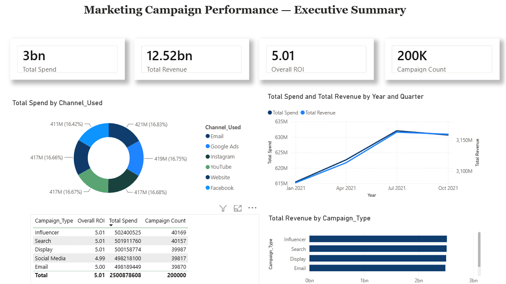
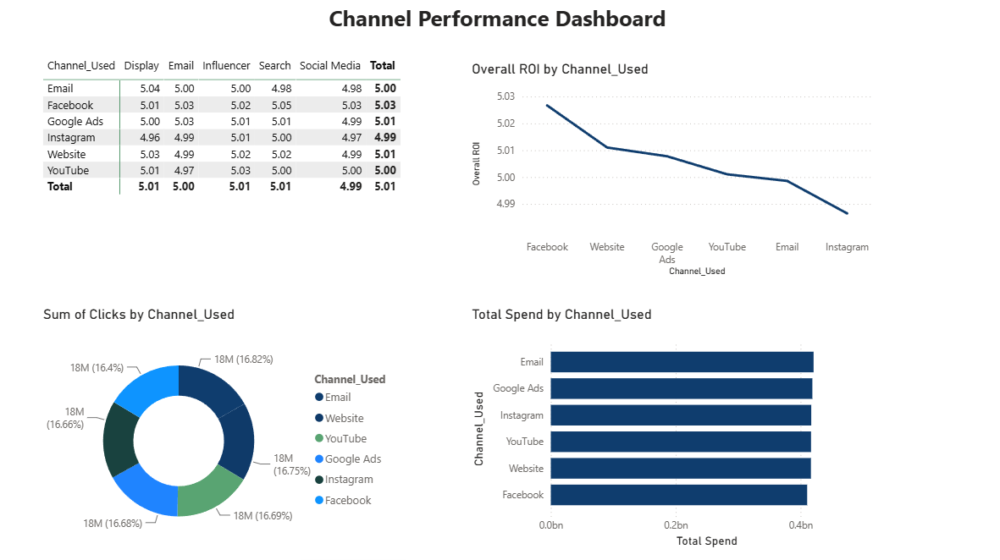
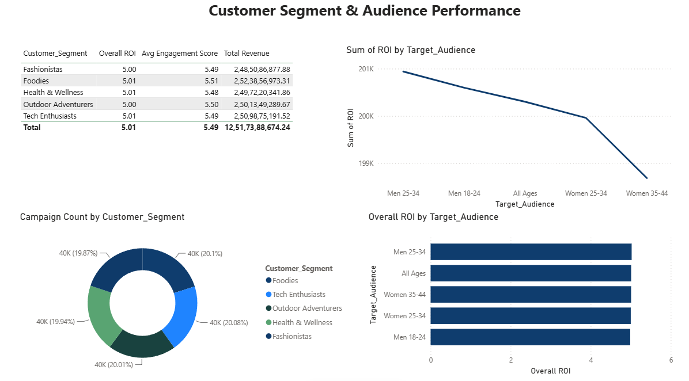
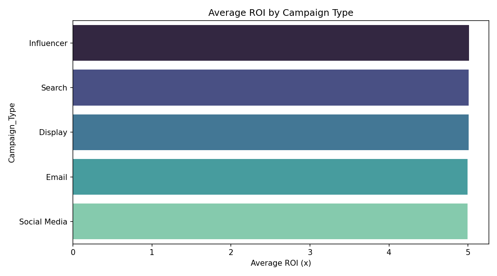
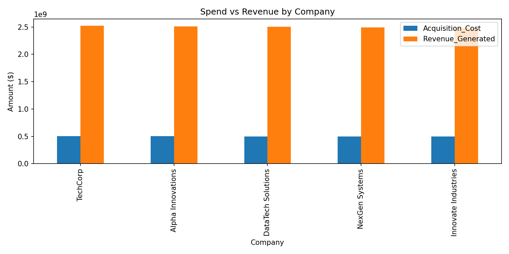
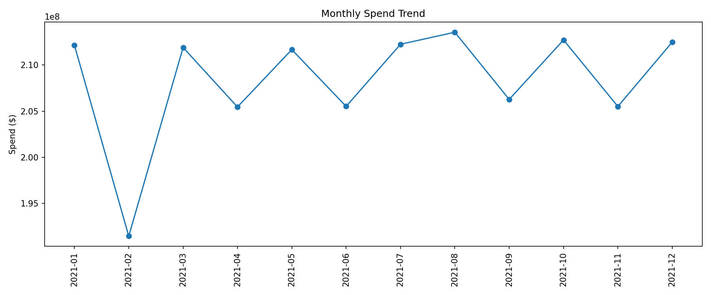
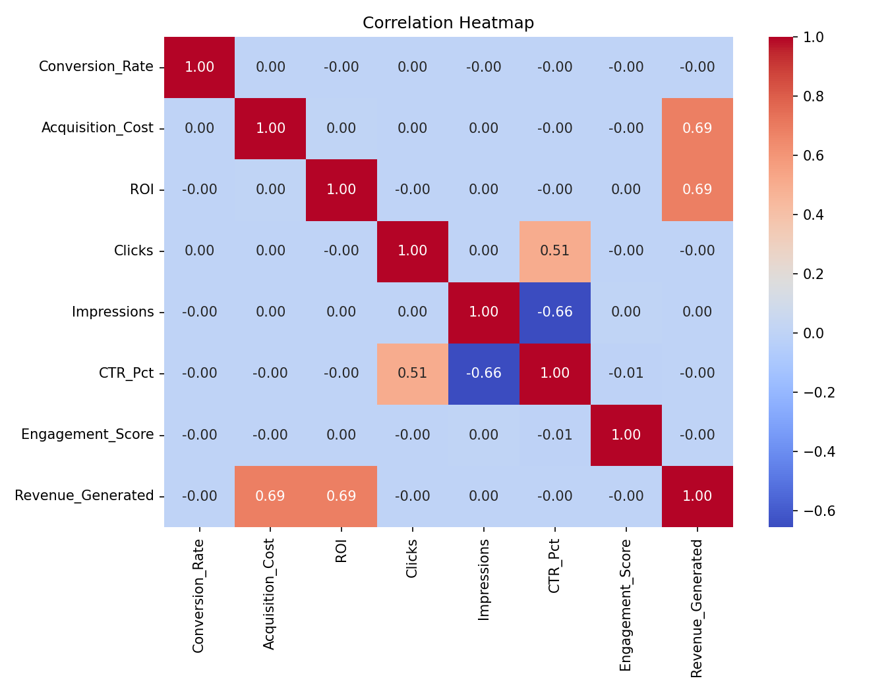

# Marketing Campaign Performance & Budget ROI Analyzer

An end-to-end data analytics project analyzing 200,000 marketing campaigns to evaluate spend efficiency, ROI, and channel/audience performance — built using **Python, SQL, and Power BI**.

## 📌 Project Overview

This project simulates a real-world marketing analytics workflow: cleaning raw campaign data, engineering performance KPIs, storing and querying the data in a relational database, and building interactive dashboards to surface insights for stakeholders.

**Dataset:** 200,000 marketing campaign records across 6 channels (Email, Google Ads, YouTube, Instagram, Website, Facebook), 5 campaign types, 5 U.S. locations, and 5 customer segments — spanning Jan–Dec 2021.

## 🛠️ Tools Used

| Tool | Purpose |
|---|---|
| **Python** (Pandas, Matplotlib, Seaborn) | Data cleaning, feature engineering, exploratory analysis |
| **MySQL** | Relational storage, KPI aggregation queries |
| **Excel** | Formatted, filterable data table |
| **Power BI** | 3-page interactive dashboard (Executive Summary, Channel Performance, Segment & Audience) |

## 📁 Repository Structure

```
marketing-campaign-roi-analyzer/
│
├── data/
│   ├── raw/marketing_campaign_dataset.csv        # Original dataset
│   └── cleaned/campaigns_clean.csv               # Cleaned + feature-engineered dataset
│
├── python/
│   └── marketing_campaign_analysis.ipynb         # Cleaning, feature engineering, EDA
│
├── sql/
│   ├── 01_schema.sql                             # Table creation
│   └── 02_kpi_queries.sql                        # 7 KPI analysis queries
│
├── excel/
│   └── campaign_data_table.xlsx                  # Formatted Excel table (200K rows, filters)
│
├── powerbi/
│   └── campaign_dashboard.pbix                   # 3-page interactive Power BI dashboard
│
├── images/                                        # EDA charts + dashboard screenshots
│
└── README.md
```

## 🔧 Data Cleaning & Feature Engineering (Python)

- Converted `Acquisition_Cost` from currency string (`"$16,174.00"`) to float
- Extracted numeric `Duration_Days` from text (`"30 days"` → `30`)
- Parsed `Date` into `Year`, `Month`, `Month_Name`, `Quarter`
- Engineered KPIs:
  - `Revenue_Generated` = ROI × Acquisition_Cost
  - `Net_Profit` = Revenue_Generated − Acquisition_Cost
  - `CTR_Pct` = Clicks / Impressions
  - `Cost_Per_Click`, `Cost_Per_Conversion`
  - `ROI_Bucket` (Low <3x / Medium 3–6x / High 6x+)
- Verified zero nulls and zero duplicate Campaign_IDs across 200,000 rows

## 🗄️ SQL Analysis

Loaded the cleaned dataset into MySQL (`marketing_campaign_db.campaigns`) and ran KPI queries covering:
- Overall spend, revenue, and ROI summary
- ROI by channel, campaign type, and location
- Top/bottom 10 campaigns by ROI
- Monthly spend & revenue trend
- Customer segment performance
- ROI bucket distribution

See [`sql/02_kpi_queries.sql`](sql/02_kpi_queries.sql) for the full query set.

## 📊 Power BI Dashboard (3 pages)

**Page 1 — Executive Summary:** KPI cards (Total Spend, Revenue, ROI, Campaign Count), monthly spend/revenue trend, campaign type breakdown table, spend-by-channel donut, revenue-by-type bar chart.

**Page 2 — Channel Performance:** Channel × Campaign Type ROI matrix, ROI-by-channel trend, click distribution donut, spend-by-channel bar chart.

**Page 3 — Segment & Audience:** Segment performance table (ROI, engagement, revenue), ROI-by-audience trend, campaign count donut by segment, ROI-by-audience bar chart.





## 📈 Key Findings

- **Total spend:** ~$2.5B across 200,000 campaigns | **Total revenue:** ~$12.5B | **Overall ROI:** ~5.01x
- ROI is **remarkably consistent (~5.0x) across every channel, campaign type, and audience segment** — indicating this dataset is synthetically generated for practice purposes rather than reflecting real-world variance. In a live business setting, this kind of flat distribution would itself be a notable (and slightly suspicious) finding worth flagging to stakeholders.
- ROI bucket distribution: **49.8% Medium ROI (3–6x)**, **33.5% High ROI (6x+)**, **16.6% Low ROI (<3x)**
- All 6 channels received near-identical budget allocation (~$410–420M each), suggesting an evenly distributed test/practice dataset rather than an optimized real campaign strategy

## 📷 EDA Visualizations







## 🚀 How to Reproduce

1. Clone this repo
2. Open `python/marketing_campaign_analysis.ipynb` in Jupyter/Colab and run all cells to regenerate the cleaned dataset and charts
3. Run `sql/01_schema.sql` then load `data/cleaned/campaigns_clean.csv` into the `campaigns` table, then run `sql/02_kpi_queries.sql`
4. Open `powerbi/campaign_dashboard.pbix` in Power BI Desktop to explore the interactive dashboard
5. Open `excel/campaign_data_table.xlsx` for a filterable spreadsheet view

## 👤 Author

Built as a portfolio project demonstrating end-to-end data analyst skills: data cleaning, SQL, and BI dashboarding.
